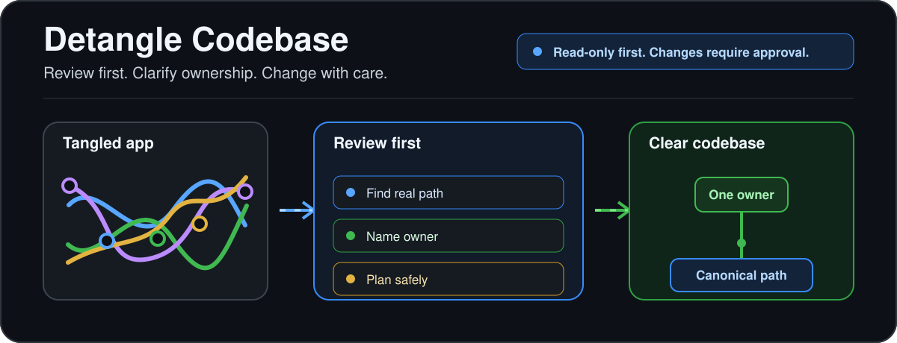
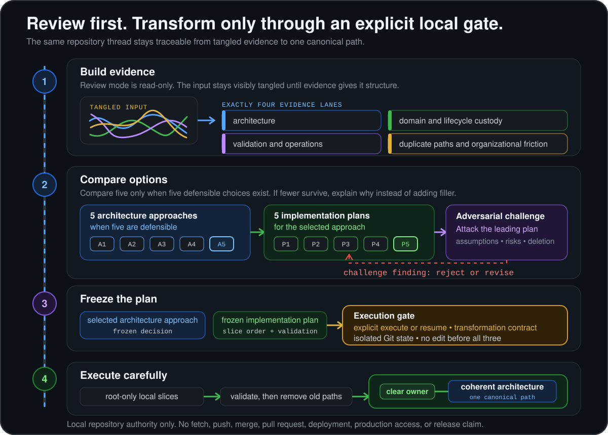

<div align="center">



# Detangle Codebase Skill: review-first architecture cleanup for tangled codebases

### Your app works. But can you safely change it?

Detangle Codebase helps turn duplicate paths, unclear ownership, and obsolete files into a codebase you can understand, debug, change, and navigate with confidence.

**Read-only first. Changes require your approval.**

</div>

---

> Detangle Codebase is a repository-agnostic Codex and Claude Code skill for making a tangled codebase easier to understand, debug, change, and navigate without changing intended behavior. It reviews the whole repository before proposing a selected architecture approach and frozen implementation plan, then changes files only after explicit `execute` or `resume` authorization, a transformation contract, and isolated Git state. It is not a formatter, an automatic code repair tool, a normal small bug-fix workflow, a deployment system, or a replacement for tests and code review.

## 🔎 See the difference

Detangle Codebase works toward clearer architecture, not merely cleaner files.

| Tangled state | Target state |
| --- | --- |
| One feature lives in routes, helpers, and components. | The feature has one clear owner. |
| Old and new routes both appear to be active. | One canonical path remains after the replacement is proven. |
| A bug could belong almost anywhere. | The owner, boundary, and nearby validation give you an obvious place to investigate. |
| Nobody knows which files are obsolete. | Superseded code, tests, flags, and docs have explicit removal criteria. |

## 🧭 How Detangle Codebase works

| Step | What happens | Change authority |
| --- | --- | --- |
| **1. Look first** | `review` reads the repository through exactly four evidence lanes and maps the current owners, paths, what must not break, and constraints. | Read-only. No file or Git changes. |
| **2. Agree on the plan** | It compares defensible architecture approaches, selects one, challenges the leading implementation plan, and freezes the decision. | Still read-only in `review`. |
| **3. Change carefully** | `execute` or `resume` applies the frozen plan in small, validated slices and removes obsolete paths after the replacement is proven. | Changes require explicit authorization, a transformation contract, and isolated Git state. |

**An ambiguous request is always `review`. Only explicit `execute` or `resume` authorizes local changes.**

## 🗺️ Why this helps people and coding agents

Clear ownership and one canonical path make it easier for a person to find where a bug belongs and where a change should start. The same clarity can help a coding agent orient itself.

A clearer repository is a better map. When the map is simpler, a coding agent may need less orientation work before a routine debugging or maintenance task. Some of those tasks may then be suitable for lighter, lower-cost Codex or Claude Code models.

That is an inference, not a promise. Detangle Codebase does not guarantee cost savings, equal quality across models, or that every task can use a lighter model. It does not replace testing or human code review.

## 💬 Example request

This is an example of a request, not captured output:

```text
$detangle review "My app works, but features and routes are duplicated and I cannot tell which implementation is real. Map the owners and canonical paths, preserve intended behavior, and recommend a safe cleanup plan. Do not modify files."
```

Invoke Detangle Codebase as `$detangle` in Codex or `/detangle` in Claude Code.

Installation differs between hosts. Install the skill directory as `detangle` so its directory and invocation name agree, then use the request above.

## 🚦 Choose a mode

| Mode | Use it when | What it may change |
| --- | --- | --- |
| `review` | You need to understand the repository and choose a plan. | Nothing. It is read-only. |
| `execute` | You explicitly authorize a new transformation. | Local isolated Git state, repository files, local validation artifacts, required docs, and local commits. |
| `resume` | You want to continue a recorded execution. | The same local scope, only after identity and state checks pass. |

## 🛡️ Safety boundaries

- **No implicit mutation:** an ambiguous invocation becomes `review`.
- **No shared writes:** the root coordinator owns every edit, deletion, Git change, and architectural decision. Evidence agents remain read-only.
- **No hidden recovery:** it never resets, cleans, stashes, rebases, amends, force-pushes, rewrites history, or silently absorbs user changes.
- **No external authority:** it does not fetch, push, open a pull request, merge, deploy, call live or paid providers, access production or customer data, or claim release readiness.

Detangle Codebase is also not a formatter, a normal small bug-fix workflow, an automatic code repair tool, or a deployment system.

## 🧩 The decision process in detail

Experienced readers can trace the review from evidence to a frozen decision.

### Four evidence lanes

The review gathers exactly four kinds of evidence:

1. **Architecture:** dependency direction, entry points, and canonical ownership.
2. **Domain and lifecycle custody:** invariants, data, transactions, security, and lifecycle ownership.
3. **Validation and operations:** tests, runtime, build, migration, and release constraints.
4. **Duplicate paths and organizational friction:** dead code, parallel implementations, unnecessary abstractions, and workflow consequences.

### Five-by-five decision rule

The root coordinator creates five materially distinct architecture approaches when five defensible choices exist. It eliminates choices that violate hard constraints, evaluates the survivors with one consistent rubric, and selects the strongest approach.

It then creates five materially distinct implementation plans for that approach when five defensible choices exist. It evaluates them consistently, adversarially challenges the leader, resolves material findings, and freezes the winning plan before changes begin.

If fewer than five defensible choices exist at either stage, it presents every defensible choice and explains why the set is smaller. It does not add filler to reach five.

## ✅ How execution converges

Before mutation, the transformation contract records the objective, success conditions, non-goals, invariants, exact base commit, dirty-path decisions, isolated execution root, allowed side effects, and validation commands.

Execution uses a new isolated worktree by default. The root coordinator then works in small coherent slices:

1. **Name the owner.** Each slice states the responsibility, its direct owner, and the behavior that must remain true.
2. **Move toward one path.** New modules or abstractions are added only when they own a distinct responsibility that cannot safely stay with an existing owner.
3. **Validate the slice.** Focused checks, regression coverage, diff inspection, and required documentation support each change.
4. **Subtract safely.** Superseded callers, exports, models, flags, adapters, wrappers, fixtures, tests, commands, diagrams, docs, and dependencies are removed after the canonical replacement is proven.

The goal is one authoritative architecture for the transformed scope. The goal is not the fewest lines, the most files, or a fashionable pattern.

## 🧱 Detailed workflow



The detailed diagram shows the complete decision and execution path. The [skill definition](SKILL.md), [strategic decision protocol](references/strategic-decision.md), and [execution contract](references/execution-contract.md) remain the source of truth.

## 🔄 How it differs from adjacent tools

| Tool | Its primary lane | Detangle Codebase's lane |
| --- | --- | --- |
| [OpenRewrite](https://docs.openrewrite.org/) | Automated refactoring recipes and source transformations. | Selects and governs a whole-repository cleanup before changes. It may inform a plan, but this repository does not claim an integration. |
| [Codemod](https://docs.codemod.com/introduction) | Large-scale maintenance campaigns and reusable code transformations. | Uses a bounded local decision and execution workflow. It does not claim hosted orchestration, codemod generation, or a registry. |
| [ast-grep](https://ast-grep.github.io/guide/rewrite-code.html) | Structural search and targeted code rewriting. | Addresses ownership, lifecycle, migration, validation, and convergence before choosing any rewrite mechanism. |
| [ArchUnit](https://www.archunit.org/userguide/html/000_Index.html) | Java architecture rules and dependency checks. | Investigates and transforms repositories across discovered stacks. It does not provide a persistent Java architecture-test DSL. |

## 📚 Why architecture clarity matters

Technical debt is broader than code style. DORA's 2019 report includes poor design, obsolete artifacts, incomplete migrations, outdated technology, and stale documentation in its examples. In its respondent model, people reporting high technical debt were 1.6 times less productive. That is an observed association in the report, not a prediction for any repository. [DORA, 2019](https://dora.dev/research/2019/dora-report/2019-dora-accelerate-state-of-devops-report.pdf)

A Google panel-data study of developers at Google found code quality and technical debt causally linked to perceived developer productivity in the studied population. The authors also found that increases in perceived code quality tended to precede increases in productivity. The result does not establish what Detangle Codebase will do in another repository. [Cheng et al., 2022](https://research.google/pubs/what-improves-developer-productivity-at-google-code-quality/)

Google SRE's guidance says a smaller project is easier to understand and test, and frequently has fewer defects. Detangle Codebase treats subtraction as useful only when obsolete machinery can be removed without breaking intended behavior. [Google SRE, 2016](https://sre.google/sre-book/simplicity/)

## ❓ FAQ

**How do I clean up a codebase when I do not know which implementation is real?** Start with `$detangle review`. It maps competing owners and paths, identifies evidence for the canonical implementation, and recommends a frozen plan without editing files.

**Can Codex or Claude Code review my repository without changing it?** Yes. `review` is read-only, and every ambiguous invocation is treated as `review`. File or Git changes require explicit `execute` or `resume` authorization.

**Is Detangle Codebase only for vibe-coded apps?** No. Vibe-coded apps are one common case because rapid AI-assisted changes can leave duplicate paths and uncertain ownership. The skill is repository-agnostic and applies when any codebase has whole-repository architecture problems.

**Will Detangle Codebase automatically fix my code?** No. Detangle Codebase is not an automatic code repair tool. It reviews first, selects an architecture approach, freezes an implementation plan, and changes files only within explicit execution authority.

**Can Detangle Codebase guarantee that a cheaper model will handle future work?** No. Clearer ownership and fewer competing paths may reduce orientation work, but model suitability still depends on the task, language, risk, context, and validation available.

**Does Detangle Codebase replace tests or code review?** No. Tests and human review remain necessary. The workflow uses validation evidence to support changes, not to bypass review.

**Does Detangle Codebase integrate with OpenRewrite, Codemod, ast-grep, or ArchUnit?** It can account for tools a repository already uses, but this repository does not claim a direct integration with them.

## 📖 Read the source instructions

- **Skill definition:** [`SKILL.md`](SKILL.md) covers invocation modes, authority boundaries, evidence lanes, decision rules, and completion.
- **Decision protocol:** [`references/strategic-decision.md`](references/strategic-decision.md) covers the five-by-five decision method, scoring, and adversarial falsification.
- **Execution contract:** [`references/execution-contract.md`](references/execution-contract.md) covers execution state, validation, coherent slices, convergence, subtraction, and recovery.
- **Codex adapter:** [`references/hosts/codex.md`](references/hosts/codex.md) maps the workflow to Codex.
- **Claude Code adapter:** [`references/hosts/claude-code.md`](references/hosts/claude-code.md) maps the workflow to Claude Code.

## 📄 License and distribution

No `LICENSE` file or repository URL is currently included. This repository therefore does not state redistribution terms, package installation steps, release status, or a support channel. Add those facts before publishing if they become available.
