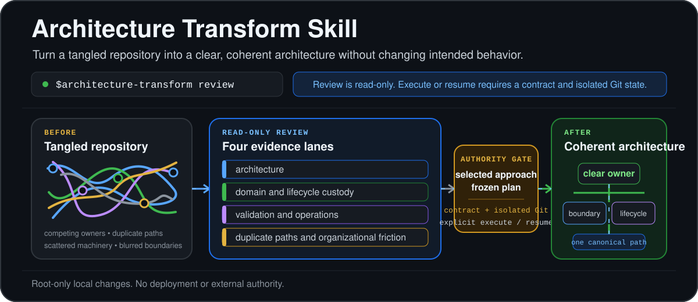
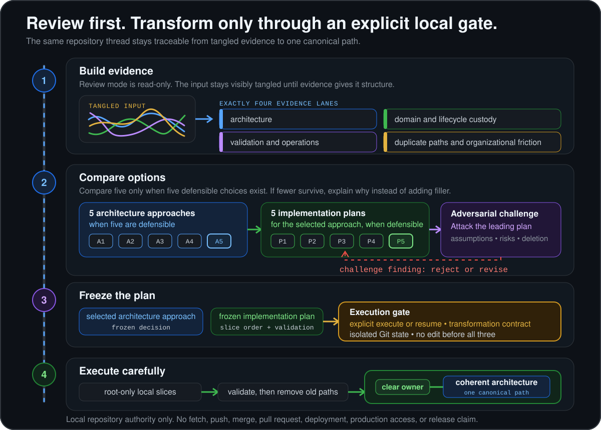

<div align="center">



# Architecture Transform Skill: repository architecture cleanup for tangled codebases

<p>A repository detangler for Codex and Claude Code. Turn a tangled repository into a clear, coherent architecture, not merely a cleaner set of files.</p>

**Review-first · Evidence-led · Local-only execution**

</div>

---

> Architecture Transform Skill is a repository detangler: a repository-agnostic Codex and Claude Code skill for turning a tangled codebase into a clear, coherent architecture without changing intended behavior. It reviews a repository through evidence lanes, compares five architecture approaches and five implementation plans when five defensible choices exist, then selects an evidence-backed architecture approach and an adversarially tested implementation plan. If fewer defensible choices exist, it explains why rather than adding filler. It changes files only in explicit `execute` or `resume` mode, after a transformation contract and isolated Git state are in place. It is not a code formatter, a small bug-fix workflow, or an autonomous deployment system.

> **Whole-repository outcome:** it clarifies ownership across the repository, converges competing paths on one canonical path, and removes obsolete machinery after the replacement is proven. It doesn't merely reformat or reshuffle files.

## 🧭 Make the whole repository coherent

- **Tangled ownership:** locate competing owners, representations, and execution paths, then converge on one canonical path.
- **Scattered machinery:** identify dead code, adapters, flags, fixtures, tests, and documentation that no longer own current behavior.
- **Blurred boundaries:** place responsibilities with their direct lifecycle, transaction, runtime, or dependency owner.
- **Risky transitions:** preserve behavior through a bounded contract, isolated Git state, proportional validation, and explicit deletion criteria.

## 🔎 What a review looks like

Start with a read-only request:

```text
$architecture-transform review "Simplify this repository without changing intended behavior. Compare five architecture approaches and five implementation plans when defensible. Explain why if fewer are warranted. Recommend a selected architecture approach and frozen implementation plan with risks, validation gates, and deletion targets."
```

The review returns a decision package, not a cosmetic folder proposal:

```text
Current-state model
  └─ entry points, owners, dependency direction, invariants, and constraints

Five architecture approaches, when defensible
  └─ an evidence-backed winner selected against a published rubric

Five implementation plans, when defensible
  └─ an adversarially tested winner frozen for execution

Decision package
  └─ risks, validation plan, non-goals, stop conditions, and deletion targets
```

This is a request-and-deliverable outline derived from the skill, not a captured execution transcript.

## 🚦 Choose a mode

> **The key boundary:** `review` never mutates a repository. `execute` and `resume` require an explicit transformation contract and isolated Git state before root-only changes begin.

| Mode | Use it when | Repository changes | Result |
| --- | --- | --- | --- |
| `review` | You need a decision before committing to a repository-wide change. | No. | Five defensible architecture approaches and five defensible implementation plans when available, plus a selected architecture approach and frozen implementation plan or an explanation of the narrower choice set. |
| `execute` | You have explicitly authorized a transformation or new investigation. | Yes, only in isolated local Git state. | Small coherent slices, validation receipts, obsolete-path removal, and local commits. |
| `resume` | You need to continue a recorded execution safely. | Only after state and identity checks pass. | Revalidated continuation from the recorded transformation state. |

## 🏁 Start with review mode

It doesn't document an installation command. Make the skill available through your Codex or Claude Code skill setup, then start with a review request.

```text
$architecture-transform review "Find the smallest coherent architecture for this repository. Preserve intended behavior. Do not modify files."
```

You receive:

- **Four evidence lanes:** architecture, domain and lifecycle custody, validation and operations, plus duplicate paths and organizational friction.
- **Architecture approaches:** five materially distinct organizing theses when five defensible choices exist. If fewer exist, it explains why and never adds filler.
- **Implementation plans:** five materially distinct ways to execute the selected architecture when five defensible choices exist, each with slices, deletion timing, validation, and recovery posture.
- **One decision:** a selected architecture approach and frozen implementation plan with assumptions, non-goals, hard constraints, and a definition of complete.

## 🧱 Execute an approved transformation

Use `execute` with either an accepted review decision or a new investigation. It doesn't edit until the decision is frozen, the transformation contract is recorded, and isolated Git state is verified.

1. **Record the contract.** Define the objective, success conditions, non-goals, invariants, exact base commit, dirty-path disposition, isolated execution root, and allowed side effects.
2. **Create isolation.** Work in a new worktree and branch by default. Verify the execution root, base commit, and branch before edits.
3. **Change by owner.** Keep writes with the root coordinator. Each slice names its owner, preserved invariant, intended files, expected deletions, proof of completion, and focused validation.
4. **Converge and verify.** Remove superseded paths when safe, update required documentation, inspect the staged diff, commit coherent green slices, then run the final local gates.

```text
$architecture-transform execute "Implement the approved architecture transformation for this repository. Preserve the recorded invariants and stop if new authority is required."
```

`execute` authorizes local work only: branch or worktree creation, repository edits, safe local validation, required local documentation, and local commits. It doesn't authorize fetching, pushing, pull requests, merging, deployment, production access, customer-data access, or release claims.

## ♻️ Resume an interrupted transformation

Use `resume` only when a prior execution record exists. It rechecks the recorded root, branch, base ancestry, current `HEAD`, Git-operation state, last known-green commit, and expected changed paths before it continues. If it can't explain the state, it stops instead of repairing Git state implicitly.

```text
$architecture-transform resume "Continue the recorded transformation after revalidating its execution contract and current Git state."
```

## 🛡️ Safety boundaries

- **No implicit mutation:** an ambiguous request is treated as `review`. Only explicit `execute` or `resume` permits edits.
- **No shared writes:** only the root coordinator edits, stages, commits, or makes architectural decisions. Evidence agents are read-only.
- **No hidden recovery:** it never resets, cleans, stashes, rebases, amends, force-pushes, rewrites history, or silently absorbs user changes.
- **No external authority:** it does not fetch, push, merge, deploy, call live or paid providers, access production or customer data, or claim release readiness.

## 🗺️ How it works



1. **Build evidence.** Map entry points, ownership, dependency direction, lifecycle custody, test and operational constraints, and duplicate paths.
2. **Compare options.** Generate five materially distinct architecture approaches when defensible, eliminate unsafe ones, and score the rest against a consistent rubric. If fewer choices are defensible, explain why.
3. **Freeze the plan.** Create five implementation plans for the winner when defensible, adversarially challenge the leader, then freeze its slice order, validation plan, and deletion targets.
4. **Execute carefully.** In `execute` or `resume` mode, make root-only changes in small coherent slices until one authoritative architecture remains.

## 🔄 How it differs from adjacent tools

| Tool | Its primary lane | Architecture Transform Skill's lane |
| --- | --- | --- |
| [OpenRewrite](https://docs.openrewrite.org/) | Automated refactoring recipes and source transformations. | Selects and governs a whole-repository cleanup before changes. It may inform a plan, but this repository does not claim an integration. |
| [Codemod](https://docs.codemod.com/introduction) | Large-scale maintenance campaigns and reusable code transformations. | Uses a bounded local decision and execution workflow. It does not claim hosted orchestration, codemod generation, or a registry. |
| [ast-grep](https://ast-grep.github.io/guide/rewrite-code.html) | Structural search and targeted code rewriting. | Addresses ownership, lifecycle, migration, validation, and convergence before choosing any rewrite mechanism. |
| [ArchUnit](https://www.archunit.org/userguide/html/000_Index.html) | Java architecture rules and dependency checks. | Investigates and transforms repositories across discovered stacks. It does not provide a persistent Java architecture-test DSL. |

## 📚 Why this matters

Technical debt is broader than code style. DORA's 2019 report includes poor design, obsolete artifacts, incomplete migrations, outdated technology, and stale documentation in its technical-debt examples. In its respondent analysis, people reporting high technical debt were 1.6 times less productive. That is an observed association in the report's model, not a promise about any one repository. [DORA, 2019](https://dora.dev/research/2019/dora-report/2019-dora-accelerate-state-of-devops-report.pdf)

Google's panel-data study found code quality and technical debt causally linked to perceived developer productivity within the studied Google population. The authors also say that increases in perceived code quality tended to precede increases in productivity. [Forsgren et al., 2022](https://research.google/pubs/what-improves-developer-productivity-at-google-code-quality/)

The skill's preference for one clear owner and deliberate subtraction also follows operational guidance: Google SRE notes that a smaller project is easier to understand and test, and frequently has fewer defects. [Google SRE, 2016](https://sre.google/sre-book/simplicity/)

## 💬 FAQ

**How do I refactor a legacy codebase without changing behavior?** To refactor a legacy codebase without changing behavior, start with `review`. It maps invariants and constraints, compares five architecture approaches and five implementation plans when five are defensible, and returns a selected architecture approach and frozen implementation plan before any mutation. Use `execute` when you explicitly authorize the transformation. It can start from that review decision or a new investigation, but edits wait for a frozen decision, contract, and isolation.

**Can Codex review a repository architecture without editing files?** Codex can review a repository architecture without editing files through `review`. The skill treats an ambiguous request as `review` and returns evidence, five architecture approaches and five implementation plans when defensible, plus a selected architecture approach and frozen implementation plan without changing Git state or files.

**How do I remove duplicate code paths and obsolete abstractions safely?** To remove duplicate code paths and obsolete abstractions safely, the execution workflow identifies canonical ownership first, changes one coherent slice at a time, validates each slice, and removes superseded machinery after the new path is proven.

**Is this a code formatter, a bug-fix skill, or an autonomous deployment tool?** It is not a code formatter, a bug-fix skill, or an autonomous deployment tool. It is for bounded, repository-wide architectural cleanup. It does not replace ordinary bug-fix work, a formatter, a test suite, code review, or deployment controls.

**Does Architecture Transform Skill work with OpenRewrite, Codemod, ast-grep, or ArchUnit?** Architecture Transform Skill can frame a decision around tools already used by a repository, but it doesn't claim an integration with those tools. They may be implementation or validation mechanisms inside an approved plan.

## 📖 Read the source instructions

- **Skill definition:** [`SKILL.md`](SKILL.md) covers invocation modes, authority boundaries, evidence lanes, decision rules, and the completion standard.
- **Decision protocol:** [`references/strategic-decision.md`](references/strategic-decision.md) covers the five-by-five decision protocol and scoring rubric.
- **Execution contract:** [`references/execution-contract.md`](references/execution-contract.md) covers execution state, validation, slice, and recovery rules.
- **Codex adapter:** [`references/hosts/codex.md`](references/hosts/codex.md) maps the workflow to Codex.
- **Claude adapter:** [`references/hosts/claude-code.md`](references/hosts/claude-code.md) maps the workflow to Claude Code.

## 📄 License and distribution

No `LICENSE` file or repository URL is currently included. It therefore doesn't state redistribution terms, package installation steps, release status, or a support channel. Add those facts before publishing if they become available.
